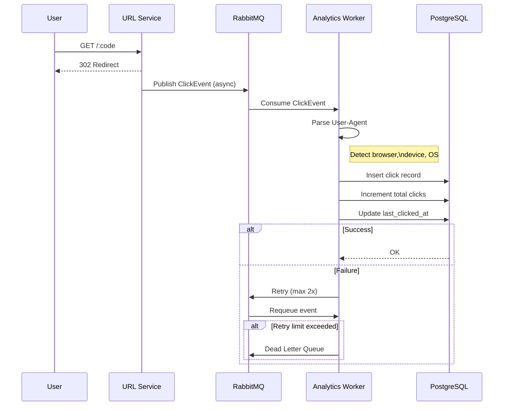

# short — URL Shortener

A URL shortener service written in Go, built with a Domain-Driven Design (DDD) architecture. Uses raw `net/http` (no framework), PostgreSQL for persistence, Redis for caching and rate limiting, and RabbitMQ for async click analytics processing.

## Project Structure

```
cmd/                    → entrypoint & wiring
  short/                → server's main.go              
  migration/            → migration's main.go
config/                 → environment config
internal/
  domain/               → entities, repository interfaces, domain errors
    url/
    queue/              → queue interface & ClickEvent entity
    cache/              → cache interface
  app/                  → application services
    url/              
  infra/
    postgres/           → PostgreSQL repository implementations
    redis/              → Redis client
      cache/            → Cache repo implementation
      rate_limitter/    → Rate limiter repo implementation and Lua script
    rabbitmq/           → RabbitMQ connection, publisher, consumer
  transport/
    http/               → server, middleware manager, route handlers
  worker/               → async analytics consumer (RabbitMQ)
  utils/                → code generation, JSON helpers
  cron/                 → Cron cleaner 
migrations/             → SQL migration files
static/                 → Frontend code (claude generated)
test/                   → Test files (k6 load test)
```

## Tech Stack

| Concern | Technology |
|---|---|
| Language | Go 1.26 |
| HTTP | `net/http` (stdlib only, no framework) |
| Database | PostgreSQL (`sqlx`, `lib/pq`) |
| Migrations | `golang-migrate` |
| Cache | Redis (`go-redis/v9`) |
| Message Queue | RabbitMQ (`amqp091-go`) |
| Validation | `go-playground/validator` |
| ID Generation | `google/uuid` |
| User-Agent Parsing | `mileusna/useragent` |

## Features

- **URL shortening** — FNV-64 URL hash XOR'd into a UUID, base64url-encoded and truncated to 8 characters 
- **Redirect** — `GET /{code}` with Redis cache layer; expired URLs served from cache to avoid DB hits
- **Click analytics** — async pipeline via RabbitMQ; captures browser, OS, device type, referrer, and timestamp per click
- **Analytics endpoint** — `GET /{code}/stat` returns aggregated browser/OS/device breakdown and total click count
- **Rate limiting** — token bucket implemented as an atomic Lua script in Redis
- **Dead-letter queue** — failed analytics messages are routed to `analytics.queue.dead` after exhausting retries
- **Graceful shutdown** — SIGINT/SIGTERM handling with configurable drain timeout
- **Cleaner** - Cron job to delete expired urls

## API

### Shorten a URL
```
POST /short
Content-Type: application/json

{
  "url": "https://example.com/some/long/path",
  "expire_at": "2025-12-31T00:00:00Z"   // optional
}
```
```json
{
  "msg": "success",
  "code": "aB3kZ9",
  "short_url": "http://localhost:3000/aB3kZ9",
  "expire_at": "2025-12-31T00:00:00Z"
}
```

### Redirect
```
GET /{code}
→ 302 redirect to original URL
```

### Analytics
```
GET /{code}/stat
```
```json
{
  "short": "aB3kZ9",
  "total_count": 142,
  "browser": { "Chrome": 98, "Firefox": 44 },
  "device":  { "Desktop": 120, "Mobile": 22 },
  "os":      { "Windows": 80, "macOS": 40, "Linux": 22 },
  "expire_at": null
}
```

## Click Analytics Pipeline



The worker runs with configurable concurrency (default 10) using a semaphore pattern, and uses manual acknowledgement (`autoAck: false`) so no clicks are lost on crash.

## Setup

### Prerequisites

- Go 1.26+
- PostgreSQL
- Redis
- RabbitMQ

### Environment

Copy `.env.example` to `.env` and fill in your values:

```env
ADDR=127.0.0.1
PORT=3000
PREFIX=http://localhost:3000/
SERVICE_NAME=short-api

PG_USER=shortuser
PG_PASSWORD=secret
PG_PORT=5432
PG_ADDRESS=localhost
PG_NAME=urlshortener
PG_SSLMODE=disable

PG_SUPERUSER=postgres
PG_SUPERDB=postgres

REDIS_ADDR=localhost:6379

RMQ_ADDR=localhost:5672
RMQ_USER=guest
RMQ_PASS=guest
```

### Run Migration
See migration section

### Run Server

```bash
go run ./cmd/short/main.go
```

The application will:
1. Connect to PostgreSQL, Redis and RabbitMQ
2. Declare the `analytics.queue` and `analytics.queue.dead` queues
3. Start the analytics worker goroutine
4. Start the HTTP server


## Migration

- Migrations are managed with `golang-migrate` and need to run manually via migrate cli.

```bash
# connects to super user and create user, database
go run ./cmd/migration/main.go -setup

# run the migration
go run ./cmd/migration/main.go -up

# rollback migration level-1
go run ./cmd/migration/main.go -down
```

# build the images and start everything in the background
docker compose up --build -d

# watch logs as services come up (migrate should run once and exit 0)
docker compose logs -f

# check status — migrate should show "Exited (0)", everything else "Up"
docker compose ps


## Load Testing

Load tested with [k6](https://k6.io) using a constant-arrival-rate scenario mixing all three core endpoints (`POST /short`, `GET /{code}`, `GET /{code}/stat`) at realistic traffic proportions (80% reads, 20% writes).

**Setup:** 1000 req/s sustained for 60s, 150–500 max VUs, run via Docker Compose (API, Postgres, Redis, RabbitMQ, MinIO all containerized).

**Run:** `shuf tests/get_urls.txt -o tests/get_urls.txt && k6 run -e RATE=1000 tests/load.js`

**With Rate Limiting Results (3 consecutive runs):**
| Run | Throughput | p90 | p95 | Failed/unexpected | Dropped iterations |
|---|---|---|---|---|---|
| 1 | 992 req/s | 29.06ms | 67.93ms | 0.00% | 475 (0.80%) |
| 2 | 992 req/s | 46.41ms | 102.93ms | 0.00% | 365 (0.61%) |
| 3 | 995 req/s | 38.16ms | 80.69ms | 0.00% | 285 (0.48%) |
| **Avg** | **993 req/s** | **~38ms** | **~84ms** | **0.00%** | **~0.63%** |

**Without Rate Limiting Results (3 consecutive runs):** Commenting rate limiter on '../transport/server.go' file
| Run | Throughput | p90 | p95 | Failed/unexpected | Dropped iterations |
|---|---|---|---|---|---|
| 1 | 981 req/s | 147.01ms | 248.89ms | 0.00% | 1109 (1.85%) |
| 2 | 970 req/s | 212.35ms | 335.7ms | 0.00% | 1787 (2.98%) |
| 3 | 920 req/s | 444.13ms | 691.12ms | 0.00% | 4605 (7.67%) |
| **Avg** | **957 req/s** | **~267.8ms** | **~425.2ms** | **0.00%** | **~4.17%** |

Only 5xx codes are treated as a failure, others 4xx are valid as they are expected.

## Future-Work
- Upgrade token bucket rate limiting to sliding window
- Follow ACID Principle on database query
- Query optimization
