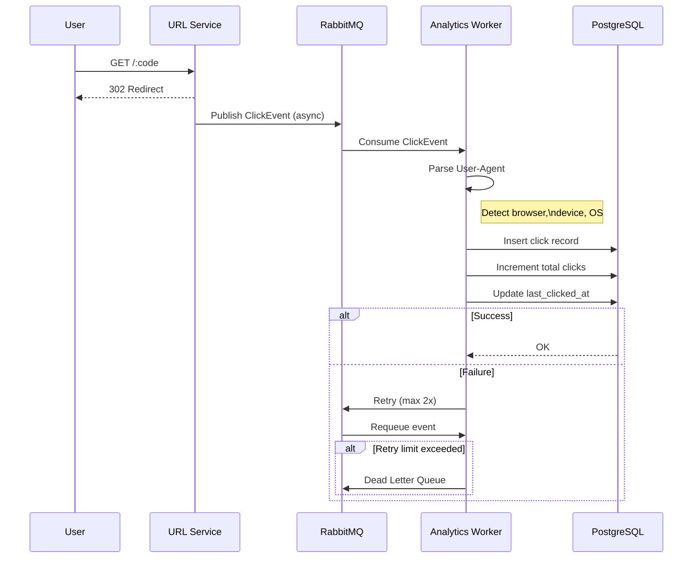

# short — URL Shortener

A URL shortener service written in Go, built with a Domain-Driven Design (DDD) architecture. Uses raw `net/http` (no framework), PostgreSQL for persistence, Redis for caching and rate limiting, and RabbitMQ for async click analytics processing.

## Project Structure

```
cmd/short/              → entrypoint & wiring
config/                 → environment config
internal/
  domain/               → entities, repository interfaces, domain errors
    url/
    queue/              → queue interface & ClickEvent entity
    cache/              → cache interface
  app/                  → application services
    url/              
  infra/
    postgres/           → PostgreSQL repository implementations
    redis/              → Redis client
      cache/            → Cache repo implementation
      rate_limitter/    → Rate limiter repo implementation and Lua script
    rabbitmq/           → RabbitMQ connection, publisher, consumer
  transport/
    http/               → server, middleware manager, route handlers
  worker/               → async analytics consumer (RabbitMQ)
  utils/                → code generation, JSON helpers
migrations/             → SQL migration files (golang-migrate)
static/                 → Frontend code (claude generated)
```

## Tech Stack

| Concern | Technology |
|---|---|
| Language | Go 1.26 |
| HTTP | `net/http` (stdlib only, no framework) |
| Database | PostgreSQL (`sqlx`, `lib/pq`) |
| Migrations | `golang-migrate` |
| Cache | Redis (`go-redis/v9`) |
| Message Queue | RabbitMQ (`amqp091-go`) |
| Validation | `go-playground/validator` |
| ID Generation | `google/uuid` |
| User-Agent Parsing | `mileusna/useragent` |

## Features

- **URL shortening** — SHA-1 + Base62 encoding with UUID salt to avoid collisions
- **Redirect** — `GET /:code` with Redis cache layer; expired URLs served from cache to avoid DB hits
- **Click analytics** — async pipeline via RabbitMQ; captures browser, OS, device type, referrer, and timestamp per click
- **Analytics endpoint** — `GET /:code/stat` returns aggregated browser/OS/device breakdown and total click count
- **Rate limiting** — token bucket implemented as an atomic Lua script in Redis
- **Dead-letter queue** — failed analytics messages are routed to `analytics.queue.dead` after exhausting retries
- **Graceful shutdown** — SIGINT/SIGTERM handling with configurable drain timeout

## API

### Shorten a URL
```
POST /short
Content-Type: application/json

{
  "url": "https://example.com/some/long/path",
  "expire_at": "2025-12-31T00:00:00Z"   // optional
}
```
```json
{
  "msg": "success",
  "code": "aB3kZ9",
  "short_url": "http://localhost:3000/aB3kZ9",
  "expire_at": "2025-12-31T00:00:00Z"
}
```

### Redirect
```
GET /:code
→ 302 redirect to original URL
```

### Analytics
```
GET /:code/stat
```
```json
{
  "short": "aB3kZ9",
  "total_count": 142,
  "browser": { "Chrome": 98, "Firefox": 44 },
  "device":  { "Desktop": 120, "Mobile": 22 },
  "os":      { "Windows": 80, "macOS": 40, "Linux": 22 },
  "expire_at": null
}
```

## Click Analytics Pipeline



The worker runs with configurable concurrency (default 10) using a semaphore pattern, and uses manual acknowledgement (`autoAck: false`) so no clicks are lost on crash.

## Setup

### Prerequisites

- Go 1.22+
- PostgreSQL
- Redis
- RabbitMQ

### Environment

Copy `.env.example` to `.env` and fill in your values:

```env
ADDR=127.0.0.1
PORT=3000
PREFIX=http://localhost:3000/
SERVICE_NAME=short-api

DB_USER=shortuser
DB_PASSWORD=secret
DB_PORT=5432
DB_ADDRESS=localhost
DB_NAME=urlshortener
DB_SSLMODE=disable

DB_SUPERUSER=postgres
DB_SUPERDB=postgres

REDIS_ADDR=localhost:6379

RMQ_ADDR=localhost:5672
RMQ_USER=guest
RMQ_PASS=guest
```

### Run

```bash
go run ./cmd/short
```

The application will:
1. Connect to PostgreSQL as the superuser and create the app role/database if they don't exist
2. Run any pending migrations automatically
3. Connect to Redis and RabbitMQ
4. Declare the `analytics.queue` and `analytics.queue.dead` queues
5. Start the analytics worker goroutine
6. Start the HTTP server

## Migration

- Migrations are managed with `golang-migrate` and run automatically on startup.

## Middleware

Global middleware is applied in FCFS order via the `middleware.Manager`:

- **Logger** — logs method, path, remote addr, and response time using `log/slog`
- **RateLimiter** — token bucket at 5 req/s per IP, capacity 10, enforced atomically via a Redis Lua script. Responds with `429` and `Retry-After` header on breach.

## Future-Work
- Proper error handling
- Upgrade token bucket rate limiting to sliding window
- Seperate migration from startup
- Dockerize the entire app
- Follow ACID Principle on database query
- Query optimization
